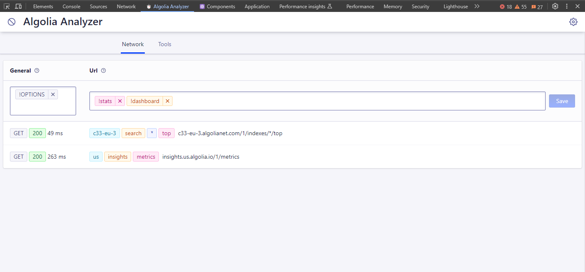

# Algolia Analyzer
## What
Algolia Analyzer is a browser extension that adds a new panel in your devtools.
That panel will capture requests made to algolia servers (algolianet.com, algolia.net) and will allow you to analyze those request.
It also provides a small tool to check the acl of an Algolia API Key.

## Install
- Download the zip file attached to [the latest release](https://github.com/algolia/algolia-analyzer/releases)
- Unpack that zip file into a folder
- visit `chrome://extensions` in your browser
- toggle the top-right "Developer mode" toggle to active
- click on the newly appeared "Load unpacked" button, and select the folder in which you unziped the zip file
  - you should see "Algolia Analyzer" in the list of your extensions!
- you might need to restart your browser for the new `⏱️ Algolia Analyzer` tab to appear in your devtools

## Screens





## Dev & Run
```ts
yarn // first install dependencies
yarn build // then build the extension

```
Then, you can go into **chrome** and import it:
- visit `chrome://extensions` in your browser
- toggle the top-right "Developer mode" toggle to active
- click on the newly appeared "Load unpacked" button, and select the folder `./dist/webext-prod`
  - you should see "Algolia Analyzer" in the list of your extensions!
- you might need to restart your browser for the new `⏱️ Algolia Analyzer` tab to appear in your devtools

Alternatively for an dev experience with file watching, you can run `yarn start` (instead of `yarn build`) and load the folder `./dist/webext-dev`
